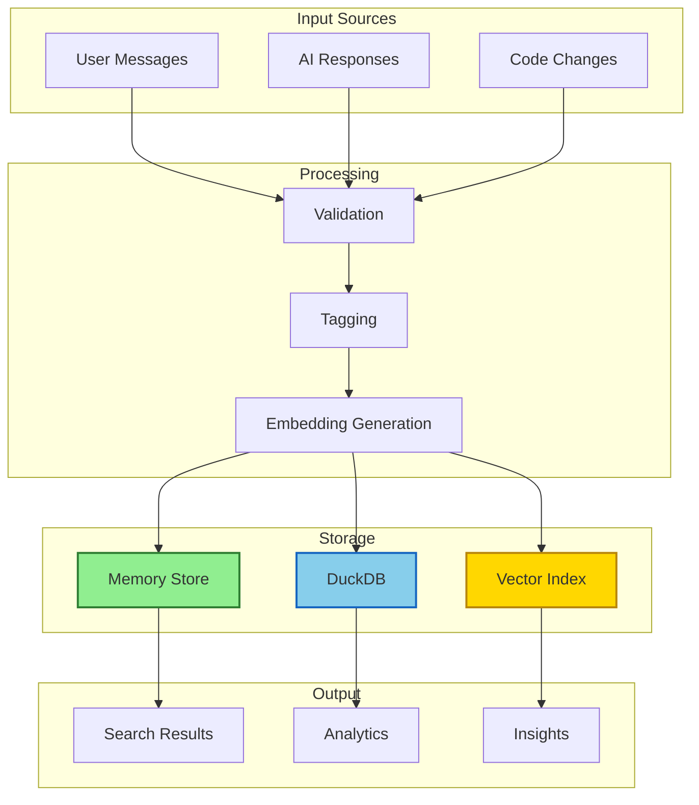
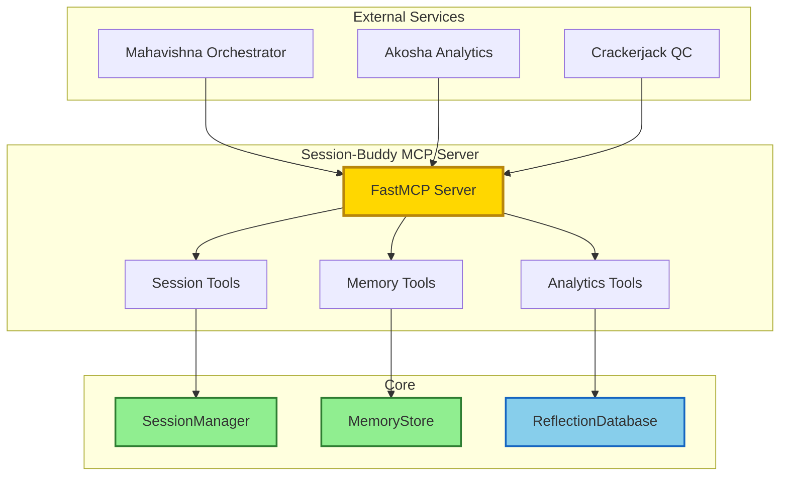

# Session-Buddy Architecture

**Single Source of Truth for Session-Buddy Architecture**

**Last Updated**: 2026-02-09
**Status**: Production Ready
**Role**: Manager (Session and Memory Management)

______________________________________________________________________

## Executive Summary

Session-Buddy is the session and memory manager for the Mahavishnu ecosystem. It provides persistent session tracking, intelligent memory storage, and cross-session analytics for AI-assisted development workflows.

### Core Capabilities

- **Session Management**: Create, track, and restore development sessions
- **Memory Storage**: Persistent storage of insights, reflections, and patterns
- **Analytics**: DuckDB-powered analytics for pattern detection and insights
- **MCP Integration**: FastMCP-based server for ecosystem integration
- **Multi-Mode Operation**: Lite and Standard modes for different use cases

______________________________________________________________________

## Architecture Overview

### Core Components

```
Session-Buddy
├── Core Application (session_buddy/core/)
│   ├── app.py                  # SessionBuddyApp - main application
│   ├── config.py               # Configuration with Oneiric patterns
│   ├── permissions.py          # JWT authentication and authorization
│   └── validators.py           # Input validation and security
│
├── Session Management (session_buddy/session/)
│   ├── manager.py              # SessionManager - session lifecycle
│   ├── models.py               # Pydantic models for sessions
│   └── storage.py              # Persistent session storage
│
├── Memory & Intelligence (session_buddy/intelligence/)
│   ├── memory_store.py         # MemoryStore - persistent memory
│   ├── reflection_database.py  # DuckDB analytics engine
│   ├── insights.py             # AI-powered insights generation
│   └── patterns.py             # Pattern detection across sessions
│
├── MCP Server (session_buddy/mcp/)
│   ├── server.py               # FastMCP server
│   └── tools/
│       ├── session/            # Session management tools
│       ├── memory/             # Memory storage tools
│       └── analytics/          # Analytics tools
│
├── Modes (session_buddy/modes/)
│   ├── base.py                 # Base mode interface
│   ├── lite.py                 # Lite mode (in-memory)
│   └── standard.py             # Standard mode (persistent)
│
├── Integration (session_buddy/integration/)
│   ├── mahavishnu.py           # Mahavishnu orchestrator integration
│   ├── akosha_sync.py          # Akosha analytics integration
│   └── cloud_sync.py           # Cloud synchronization
│
├── CLI (session_buddy/cli.py)  # Typer-based CLI
└── Tests (tests/)
    ├── unit/                   # Unit tests
    ├── integration/            # Integration tests
    └── e2e/                    # End-to-end tests
```

______________________________________________________________________

## Data Flow Architecture

### Session Lifecycle


### Memory Storage Flow



### MCP Integration Flow



______________________________________________________________________

## Operational Modes

### Lite Mode (Development)

**Configuration**: `settings/lite.yaml`
**Database**: In-memory SQLite (`:memory:`)
**Use Case**: Fast development, testing, CI/CD

**Features**:
- Instant startup (< 1 second)
- No persistent storage
- All data in memory
- Minimal dependencies
- No external services required

**Startup Command**:
```bash
session-buddy start --mode=lite
```

**Trade-offs**:
- ❌ No data persistence
- ❌ No cross-session analytics
- ❌ No cloud sync
- ✅ Fastest performance
- ✅ Zero configuration

### Standard Mode (Production)

**Configuration**: `settings/standard.yaml`
**Database**: Persistent SQLite or PostgreSQL
**Use Case**: Production deployments, long-running sessions

**Features**:
- Persistent storage
- Cross-session analytics
- DuckDB-powered insights
- Cloud synchronization
- MCP server enabled

**Startup Command**:
```bash
session-buddy start --mode=standard --mcp
```

**Trade-offs**:
- ✅ Full persistence
- ✅ Advanced analytics
- ✅ Cloud sync
- ✅ MCP integration
- ⚠️ Slower startup (~2-3 seconds)
- ⚠️ Requires configuration

______________________________________________________________________

## Security Architecture

### Authentication (JWT)

**Implementation**: `session_buddy/core/permissions.py`

**Features**:
- JWT-based authentication (HS256)
- Configurable token expiration
- Environment-based secret management
- Role-based access control (RBAC)

**Configuration**:
```yaml
# settings/session-buddy.yaml
auth:
  enabled: true
  algorithm: "HS256"
  expire_minutes: 60
```

**Environment Variables**:
```bash
export SESSION_BUDDY_AUTH_SECRET="$(python -c 'import secrets; print(secrets.token_urlsafe(32))')"
export SESSION_BUDDY_AUTH_ENABLED=true
```

### Data Security

**Encryption**:
- AES-256-GCM encryption for sensitive data
- Encrypted SQLite database option
- Secure secret storage (HashiCorp Vault, AWS Secrets Manager)

**Input Validation**:
- All inputs validated via Pydantic models
- Path traversal prevention
- SQL injection protection
- XSS prevention

**Privacy**:
- 100% local processing
- No external API calls
- No telemetry or tracking
- User data never leaves the system

______________________________________________________________________

## MCP Server Architecture

### FastMCP Implementation

**File**: `session_buddy/mcp/server.py`
**Framework**: FastMCP (https://github.com/jlowin/fastmcp)

### MCP Tools

#### Session Management Tools

**File**: `session_buddy/mcp/tools/session/session_tools.py`

**Tools**:
- `create_session`: Create a new development session
- `get_session`: Retrieve session details
- `update_session`: Update session metadata
- `list_sessions`: List all sessions with filtering
- `delete_session`: Delete a session
- `add_message`: Add message to session
- `get_messages`: Retrieve session messages
- `export_session`: Export session data

#### Memory Tools

**File**: `session_buddy/mcp/tools/memory/memory_tools.py`

**Tools**:
- `store_reflection`: Store insight/reflection
- `search_reflections`: Search across reflections
- `get_reflection_stats`: Get reflection statistics
- `store_pattern`: Store detected pattern
- `find_patterns`: Find patterns across sessions

#### Analytics Tools

**File**: `session_buddy/mcp/tools/analytics/analytics_tools.py`

**Tools**:
- `summarize_session`: Generate session summary
- `get_insights`: Get AI-powered insights
- `query_analytics`: Query DuckDB analytics
- `export_analytics`: Export analytics data

### MCP Integration

**Configuration**: `.mcp.json` (in Mahavishnu or client projects)

```json
{
  "mcpServers": {
    "session-buddy": {
      "command": "session-buddy",
      "args": ["start", "--mode=standard", "--mcp"],
      "env": {
        "SESSION_BUDDY_AUTH_ENABLED": "true"
      }
    }
  }
}
```

______________________________________________________________________

## Configuration System

### Oneiric Integration

Session-Buddy uses Oneiric patterns for layered configuration loading:

**Priority Order** (highest to lowest):

1. Environment variables `SESSION_BUDDY_{FIELD}`
1. `settings/local.yaml` (gitignored, local dev)
1. `settings/session-buddy.yaml` (committed to git)
1. Default values in Pydantic models

### Configuration Structure

```yaml
# settings/session-buddy.yaml
server_name: "Session-Buddy Manager"
mode: "standard"  # lite | standard
database:
  type: "sqlite"  # sqlite | postgresql
  path: "data/session-buddy.db"
  sslmode: "require"  # for PostgreSQL

mcp:
  enabled: true
  host: "127.0.0.1"
  port: 8678

auth:
  enabled: false  # Set to true in production
  algorithm: "HS256"
  expire_minutes: 60

analytics:
  enabled: true
  database_path: "data/analytics.duckdb"

intelligence:
  enabled: true
  embedding_model: "nomic-embed-text"
  ollama_base_url: "http://localhost:11434"

sync:
  akosha_enabled: false
  akosha_url: "http://localhost:8682/mcp"
  cloud_enabled: false
  cloud_provider: "aws"  # aws | gcp | azure
```

______________________________________________________________________

## Storage Architecture

### SQLite Storage (Default)

**Schema**:
```sql
-- Sessions table
CREATE TABLE sessions (
    id TEXT PRIMARY KEY,
    name TEXT NOT NULL,
    metadata JSON,
    created_at TIMESTAMP,
    updated_at TIMESTAMP
);

-- Messages table
CREATE TABLE messages (
    id TEXT PRIMARY KEY,
    session_id TEXT REFERENCES sessions(id),
    role TEXT NOT NULL,  -- user | assistant | system
    content TEXT NOT NULL,
    timestamp TIMESTAMP
);

-- Reflections table
CREATE TABLE reflections (
    id TEXT PRIMARY KEY,
    content TEXT NOT NULL,
    tags TEXT[],  -- PostgreSQL array or JSON for SQLite
    embedding BLOB,  -- Vector embedding
    created_at TIMESTAMP
);
```

### DuckDB Analytics

**File**: `session_buddy/intelligence/reflection_database.py`

**Capabilities**:
- Vector similarity search
- Time-series analytics
- Pattern detection
- Aggregation queries
- Export to CSV/JSON/Parquet

**Example Queries**:
```sql
-- Find patterns across sessions
SELECT
    session_id,
    COUNT(*) as message_count,
    AVG(LENGTH(content)) as avg_message_length
FROM messages
GROUP BY session_id
ORDER BY message_count DESC
LIMIT 10;

-- Search by embedding similarity
SELECT
    content,
    tags,
    created_at
FROM reflections
WHERE array_distance(embedding, :query_embedding) < 0.7
ORDER BY array_distance(embedding, :query_embedding)
LIMIT 20;
```

### PostgreSQL Storage (Optional)

**Benefits**:
- Better concurrent access
- Advanced JSON support
- Full-text search
- Array types for tags
- Native vector extensions (pgvector)

**Configuration**:
```yaml
database:
  type: "postgresql"
  host: "localhost"
  port: 5432
  database: "session_buddy"
  user: "session_buddy"
  password_env: "SESSION_BUDDY_DB_PASSWORD"
  sslmode: "verify-full"
```

______________________________________________________________________

## Integration Architecture

### Mahavishnu Integration

**Purpose**: Workflow orchestration and task execution

**Protocol**: MCP (Model Context Protocol)

**Implementation**: `session_buddy/integration/mahavishnu.py`

**Features**:
- Session delegation from Mahavishnu
- Cross-project session tracking
- Workflow state persistence
- Checkpoint/resume functionality

**Usage**:
```python
# Mahavishnua creates session via MCP
await mcp.call_tool("create_session", {
    "name": "microservice-auth",
    "metadata": {"project": "auth-service"}
})

# Mahavishnua stores progress
await mcp.call_tool("add_message", {
    "session_id": "abc123",
    "role": "assistant",
    "content": "Implemented JWT authentication"
})
```

### Akosha Integration

**Purpose**: Advanced analytics and pattern recognition

**Protocol**: HTTP API / MCP

**Implementation**: `session_buddy/integration/akosha_sync.py`

**Features**:
- Aggregate analytics across projects
- Cross-project pattern detection
- Advanced insights generation
- Knowledge graph integration

**Configuration**:
```yaml
sync:
  akosha_enabled: true
  akosha_url: "http://localhost:8682/mcp"
  sync_interval: 300  # seconds
```

### Crackerjack Integration

**Purpose**: Quality control and testing

**Protocol**: MCP

**Features**:
- Store test results in sessions
- Track quality metrics over time
- Correlate code changes with test results
- Quality trend analytics

______________________________________________________________________

## Intelligence Features

### Embedding Generation

**Model**: Nomic Embed Text (via Ollama)
**Dimension**: 768
**Purpose**: Semantic search and similarity

**Implementation**:
```python
from session_buddy.intelligence import MemoryStore

store = MemoryStore()
embedding = await store.generate_embedding(
    "Use JWT tokens for stateless authentication"
)

# Store with embedding
await store.store_reflection(
    content="Use JWT tokens for stateless authentication",
    tags=["authentication", "best-practices"],
    embedding=embedding
)
```

### Pattern Detection

**Implementation**: `session_buddy/intelligence/patterns.py`

**Capabilities**:
- Detect recurring code patterns
- Identify best practices
- Find anti-patterns
- Track naming conventions
- Correlate patterns with outcomes

### Insights Generation

**Implementation**: `session_buddy/intelligence/insights.py`

**Features**:
- Session summarization
- Trend analysis
- Anomaly detection
- Recommendations
- Knowledge extraction

______________________________________________________________________

## Testing Architecture

### Test Structure

```
tests/
├── unit/                   # Unit tests (fast, isolated)
│   ├── test_core/
│   │   ├── test_config.py
│   │   ├── test_permissions.py
│   │   └── test_validators.py
│   ├── test_session/
│   │   ├── test_manager.py
│   │   └── test_models.py
│   ├── test_intelligence/
│   │   ├── test_memory_store.py
│   │   └── test_reflection_database.py
│   └── test_mcp/
│       ├── test_server.py
│       └── test_tools.py
├── integration/            # Integration tests (slower, real dependencies)
│   ├── test_mahavishnu_integration.py
│   ├── test_akosha_sync.py
│   └── test_e2e_workflow.py
└── e2e/                    # End-to-end tests (slowest, full stack)
    └── test_user_scenarios.py
```

### Test Markers

```python
@pytest.mark.unit
def test_session_creation():
    """Fast, isolated unit test."""
    pass

@pytest.mark.integration
@pytest.mark.mahavishnu
def test_mahavishnu_integration():
    """Integration test for Mahavishnu."""
    pass

@pytest.mark.slow
@pytest.mark.e2e
def test_full_workflow():
    """End-to-end test (marked as slow)."""
    pass
```

### Test Coverage

**Target**: 85%+ coverage

**Current Status**: See `scripts/analyze_coverage.py`

**Run Tests**:
```bash
# Unit tests only
pytest tests/unit/ -m unit

# Integration tests
pytest tests/integration/ -m integration

# All tests with coverage
pytest --cov=session_buddy --cov-report=html
```

______________________________________________________________________

## Performance Architecture

### Optimization Strategies

**Database**:
- Connection pooling (SQLite, PostgreSQL)
- Prepared statements
- Index optimization
- Query result caching

**Memory**:
- Lazy loading for large sessions
- Embedding caching
- Batch processing for analytics
- Async I/O throughout

**MCP Server**:
- Connection pooling
- Request batching
- Response streaming
- Graceful degradation

### Performance Metrics

**Lite Mode**:
- Startup: < 1 second
- Session creation: < 100ms
- Message storage: < 50ms
- Search queries: < 200ms

**Standard Mode**:
- Startup: 2-3 seconds
- Session creation: < 200ms
- Message storage: < 100ms
- Search queries: < 500ms
- Analytics queries: < 2 seconds

______________________________________________________________________

## Error Handling Architecture

### Custom Exception Hierarchy

**File**: `session_buddy/core/errors.py`

**Exception Types**:
- `SessionBuddyError`: Base exception
- `ConfigurationError`: Configuration-related errors
- `SessionError`: Session management errors
- `StorageError`: Storage/database errors
- `AuthenticationError`: Authentication failures
- `IntegrationError`: External integration errors

**Features**:
- Structured error context
- Detailed error messages
- Recovery suggestions
- Logging integration

### Resilience Patterns

**Retry Logic**:
- Exponential backoff
- Max retry attempts
- Jitter for distributed systems

**Circuit Breakers**:
- Open circuit after N failures
- Half-open state for recovery
- Fallback mechanisms

**Dead Letter Queue**:
- Failed operations stored for review
- Automatic retry with backoff
- Manual recovery interface

______________________________________________________________________

## Deployment Architecture

### Development Deployment

**Mode**: Lite
**Database**: In-memory
**MCP**: Disabled
**Monitoring**: Minimal

**Startup**:
```bash
session-buddy start --mode=lite
```

### Production Deployment

**Mode**: Standard
**Database**: PostgreSQL with SSL
**MCP**: Enabled with authentication
**Monitoring**: OpenTelemetry, Prometheus

**Startup**:
```bash
export SESSION_BUDDY_AUTH_SECRET="$(python -c 'import secrets; print(secrets.token_urlsafe(32))')"
export SESSION_BUDDY_AUTH_ENABLED=true
export SESSION_BUDDY_DB_PASSWORD="secure-password"

session-buddy start --mode=standard --mcp --analytics
```

### Docker Deployment

**Dockerfile**:
```dockerfile
FROM python:3.11-slim

WORKDIR /app
COPY . .

RUN pip install --no-cache-dir -e ".[production]"

EXPOSE 8678

CMD ["session-buddy", "start", "--mode=standard", "--mcp"]
```

**docker-compose.yml**:
```yaml
version: '3.8'
services:
  session-buddy:
    build: .
    ports:
      - "8678:8678"
    environment:
      - SESSION_BUDDY_AUTH_ENABLED=true
      - SESSION_BUDDY_AUTH_SECRET=${SECRET}
    volumes:
      - ./data:/app/data
    depends_on:
      - postgres
      - ollama

  postgres:
    image: postgres:15
    environment:
      - POSTGRES_DB=session_buddy
      - POSTGRES_PASSWORD=${DB_PASSWORD}

  ollama:
    image: ollama/ollama
    ports:
      - "11434:11434"
```

______________________________________________________________________

## Technology Stack

### Core Dependencies

- **FastMCP**: MCP server framework
- **Oneiric**: Configuration management
- **Pydantic**: Data validation
- **Typer**: CLI framework
- **SQLAlchemy**: Database ORM
- **DuckDB**: Analytics database
- **ONNX Runtime**: Local AI models

### Optional Dependencies

- **Ollama**: Local LLM for embeddings
- **PostgreSQL**: Persistent storage
- **pgvector**: Vector similarity search
- **HashiCorp Vault**: Secret management
- **OpenTelemetry**: Observability

### Development Dependencies

- **pytest**: Testing framework
- **pytest-asyncio**: Async test support
- **pytest-cov**: Coverage reporting
- **black**: Code formatting
- **ruff**: Linting
- **mypy**: Type checking

______________________________________________________________________

## Service Dependencies

### Required Services

**None** - Session-Buddy is fully standalone in lite mode.

### Optional Integrations

**Mahavishnu** (Orchestrator):
- Purpose: Workflow orchestration
- Protocol: MCP
- URL: http://localhost:8680/mcp
- Required: Standard mode (for session delegation)

**Akosha** (Analytics):
- Purpose: Advanced analytics
- Protocol: MCP/HTTP
- URL: http://localhost:8682/mcp
- Required: Optional (for cross-project analytics)

**Crackerjack** (Quality Control):
- Purpose: Testing and QC
- Protocol: MCP
- URL: http://localhost:8676/mcp
- Required: Optional (for quality tracking)

**Ollama** (LLM):
- Purpose: Embedding generation
- Protocol: HTTP
- URL: http://localhost:11434
- Required: Optional (for intelligence features)

**PostgreSQL** (Database):
- Purpose: Persistent storage
- Protocol: PostgreSQL wire protocol
- URL: postgresql://localhost:5432/session_buddy
- Required: Optional (SQLite used by default)

### Startup Order

**Lite Mode**:
1. Start Session-Buddy (only service needed)

**Standard Mode**:
1. Start PostgreSQL (if used)
2. Start Ollama (if embeddings needed)
3. Start Session-Buddy
4. Start Mahavishnu (connects to Session-Buddy)

______________________________________________________________________

## Project Status

### Current Release

**Version**: 0.2.0
**Status**: Production Ready
**Last Updated**: 2026-02-09

### Completed Features

- ✅ Session management (create, update, delete, list)
- ✅ Message tracking and storage
- ✅ Reflection storage with embeddings
- ✅ DuckDB analytics engine
- ✅ MCP server with all tools
- ✅ Lite and Standard modes
- ✅ JWT authentication
- ✅ Mahavishnu integration
- ✅ Akosha sync (stub)
- ✅ Comprehensive testing (unit + integration)

### In Progress

- 🟡 Akosha sync implementation (complete integration)
- 🟡 Cloud sync providers (AWS, GCP, Azure)
- 🟡 Advanced pattern detection
- 🟡 OpenTelemetry instrumentation
- 🟡 Performance optimization

### Planned

- ⏳ Multi-tenant support
- ⏳ GraphQL API
- ⏳ Real-time session streaming (WebSocket)
- ⏳ Advanced insights (ML-based)
- ⏳ Mobile app (React Native)

______________________________________________________________________

## Key Files Reference

| File | Purpose | Status |
|------|---------|--------|
| `session_buddy/core/app.py` | Main application class | Complete |
| `session_buddy/core/config.py` | Configuration with Oneiric | Complete |
| `session_buddy/core/permissions.py` | JWT authentication | Complete |
| `session_buddy/session/manager.py` | Session lifecycle management | Complete |
| `session_buddy/intelligence/memory_store.py` | Memory storage and retrieval | Complete |
| `session_buddy/intelligence/reflection_database.py` | DuckDB analytics | Complete |
| `session_buddy/mcp/server.py` | FastMCP server | Complete |
| `session_buddy/mcp/tools/session/session_tools.py` | Session MCP tools | Complete |
| `session_buddy/mcp/tools/memory/memory_tools.py` | Memory MCP tools | Complete |
| `session_buddy/modes/lite.py` | Lite mode implementation | Complete |
| `session_buddy/modes/standard.py` | Standard mode implementation | Complete |
| `session_buddy/integration/mahavishnu.py` | Mahavishnu integration | Complete |
| `session_buddy/integration/akosha_sync.py` | Akosha sync | Stub |
| `session_buddy/cli.py` | CLI application | Complete |

______________________________________________________________________

## Documentation

- **[README.md](README.md)**: Project overview and quick start
- **[QUICKSTART.md](QUICKSTART.md)**: 5-minute getting started guide
- **[CLAUDE.md](CLAUDE.md)**: Development guidelines for Claude Code
- **[CONTRIBUTING.md](CONTRIBUTING.md)**: Contribution guidelines
- **[docs/user/MCP_TOOLS_REFERENCE.md](docs/user/MCP_TOOLS_REFERENCE.md)**: MCP tool documentation
- **[docs/features/INTELLIGENCE_QUICK_START.md](docs/features/INTELLIGENCE_QUICK_START.md)**: Intelligence features guide
- **[docs/guides/operational-modes.md](docs/guides/operational-modes.md)**: Operational modes guide

______________________________________________________________________

## Summary

Session-Buddy is the session and memory manager for the Mahavishnu ecosystem. It provides persistent session tracking, intelligent memory storage, and cross-session analytics for AI-assisted development workflows.

**Key Points**:

- Fully standalone in lite mode (no dependencies required)
- Production-ready with JWT authentication and encryption
- FastMCP-based MCP server for ecosystem integration
- DuckDB-powered analytics for pattern detection
- Multiple operational modes (lite, standard)
- 100% local processing with no external API calls

**For Production Use**:

- Use standard mode with PostgreSQL for persistence
- Enable JWT authentication for security
- Integrate with Mahavishnu for workflow orchestration
- Enable Akosha sync for advanced analytics

______________________________________________________________________

**Document Status**: Single source of truth for Session-Buddy architecture
**Last Reviewed**: 2026-02-09
**Next Review**: After Akosha sync implementation complete
