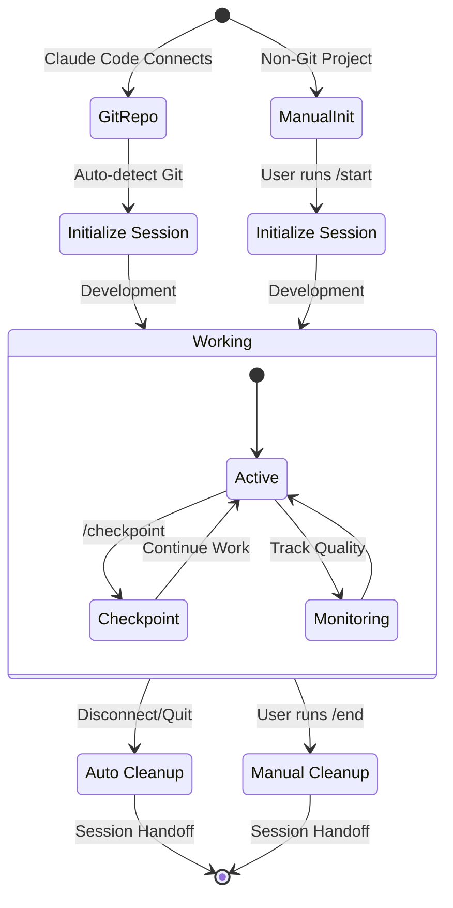

# Session-Buddy

[](https://github.com/lesleslie/crackerjack)
[](https://github.com/lesleslie/oneiric)
[](https://github.com/jlowin/fastmcp)
[](https://github.com/astral-sh/uv)
[](https://www.python.org/downloads/)

Session-Buddy is a session-lifecycle and memory MCP server for Claude Code and
other MCP clients. It manages session startup, checkpoints, cleanup, searchable
reflections, cross-project context, and quality signals through a local
DuckDB-backed service.

## Quick Links

- [Capabilities](#capabilities)
- [MCP Surface](#mcp-surface)
- [Configuration](#configuration)
- [Automatic Session Management](#automatic-session-management)
- [Integration with Crackerjack](#integration-with-crackerjack)
- [Quality Checks](#quality-checks)
- [Documentation](#documentation)

## Quality Checks

Crackerjack is the canonical quality gate for repository changes. Use the
focused checks while iterating and the full gate before handoff:

```bash
crackerjack lint
crackerjack typecheck
crackerjack security
crackerjack run --run-tests
```

## Capabilities

### Session lifecycle

- Initialize, checkpoint, inspect, and end sessions through MCP tools.
- Detect Git repositories and perform lifecycle setup and cleanup automatically.
- Create handoff context and capture learnings during checkpoints and session end.
- Keep pre-compaction hooks and session state available to Claude Code.

For non-Git projects, the same lifecycle can be invoked explicitly through the
MCP tools.

### Memory and search

- Store reflections and conversation context in DuckDB.
- Search by text, concept, file, project, or time-oriented queries.
- Reuse context across sessions and related repositories.
- Use local text search without an embedding service; semantic search can use a
  configured HTTP provider such as llama-server or Ollama and degrades
  gracefully when no provider is available.

### Cross-project intelligence

Project groups and dependency relationships let searches include related
repositories and rank results using project context. This is useful for
multi-repository services, monorepos, and coordinated development work.

### Quality and operational signals

Session-Buddy integrates with Crackerjack to record quality results, test
patterns, failure resolutions, and workflow context. It also exposes health,
Prometheus metrics, WebSocket monitoring, analytics commands, and signed
skill/agent metadata for MCP clients.

### Learning and skills

Session-Buddy captures reflections during checkpoints and session cleanup using
deterministic extraction and content-hash deduplication. Captured knowledge can
then be retrieved through the memory and search tools.

The server also publishes signed capability metadata for MCP clients:

- Skills: `session_buddy_list_skills`, `session_buddy_get_skill`
- Agents: `session_buddy_list_agents`, `session_buddy_get_agent`

These catalogs describe available capabilities; they do not perform autonomous
self-modification. See [Insights Capture](docs/features/INSIGHTS_CAPTURE.md)
for the capture and retrieval details.

______________________________________________________________________

## Automatic Session Management

When the MCP server is connected from a Git repository, Session-Buddy can
initialize the session on connection and perform cleanup on disconnect. The
`start`, `checkpoint`, `status`, and `end` tools remain available for explicit
control, and non-Git projects use that explicit workflow by default.

### Lifecycle at a glance



## MCP Surface

The MCP server exposes a profile-gated tool surface through
`SESSION_BUDDY_TOOL_PROFILE`:

- `minimal` — session lifecycle, basic search, hooks, health, baseline probes,
  and published agent metadata.
- `standard` — the daily-development surface, including conversation,
  extraction, knowledge graph, Crackerjack, monitoring, cross-repository,
  skills, and agent tools.
- `full` — all registered tool groups; this is the default when the variable is
  unset or invalid.

The active profile is defined in
[`session_buddy/mcp/tools/profiles.py`](session_buddy/mcp/tools/profiles.py).
The complete reference is in
[`docs/user/MCP_TOOLS_REFERENCE.md`](docs/user/MCP_TOOLS_REFERENCE.md).

Always-available baseline tools include:

| Tool | Purpose |
|------|---------|
| `discover_tools(query)` | List registered tools, optionally filtered by name substring |
| `get_liveness()` | Return service, version, and uptime information |
| `get_readiness()` | Probe configured dependencies |
| `health_check_all()` | Return a dependency health summary |

Core session and memory tools include `start`, `checkpoint`, `status`, `end`,
`store_reflection`, `quick_search`, `search_summary`, `search_by_file`, and
`search_by_concept`.

The signed catalogs expose server-published capabilities through:

- `session_buddy_list_skills` and `session_buddy_get_skill`
- `session_buddy_list_agents` and `session_buddy_get_agent`

The HTTP service also provides `/health`, `/healthz`, and `/metrics` on the
main service port.

## Integration with Crackerjack

Crackerjack is Session-Buddy's quality and CI/CD integration point. Session-
Buddy can retain quality results, test outcomes, failure patterns, and useful
resolutions as session context so later checkpoints and sessions can retrieve
them.

Typical local validation is:

```bash
crackerjack run --run-tests
```

See [Crackerjack Integration](docs/CRACKERJACK.md) for the MCP tools and
integration details.

## Quick Start

### Prerequisites

- Python 3.14+
- [uv](https://docs.astral.sh/uv/) or pip
- An MCP client that supports streamable HTTP

### Install and start

```bash
git clone https://github.com/lesleslie/session-buddy.git
cd session-buddy
uv sync

# Start the streamable HTTP MCP service on 127.0.0.1:8678
uv run session-buddy server start
```

Useful lifecycle and diagnostics commands:

```bash
uv run session-buddy server status
uv run session-buddy server health
uv run session-buddy health
uv run session-buddy doctor
```

### Connect an MCP client

The service endpoint is `http://127.0.0.1:8678/mcp`. Add an HTTP entry to the
client configuration:

```json
{
  "mcpServers": {
    "session-buddy": {
      "type": "http",
      "url": "http://127.0.0.1:8678/mcp"
    }
  }
}
```

Core text search works without an embedding service. Semantic search uses a
configured HTTP embedding provider such as llama-server or Ollama when one is
available.

## Usage

After the MCP client connects, use the session prompts and tools directly:

```text
/session-buddy:start
/session-buddy:checkpoint
/session-buddy:quick_search
/session-buddy:store_reflection
/session-buddy:end
```

The primary MCP tools are `start`, `checkpoint`, `status`, `end`,
`quick_search`, `search_summary`, `search_by_file`, `search_by_concept`, and
`store_reflection`. Claude Code shortcuts such as `/start`, `/checkpoint`, and
`/end` may be generated under `~/.claude/commands/` after initialization.

## Configuration

Session-Buddy uses Oneiric's layered settings model together with the
repository's flat YAML compatibility layer. The project files are:

- `settings/session-buddy.yaml` — committed defaults
- `settings/local.yaml` — gitignored checkout-local overrides
- `settings/lite.yaml` and `settings/standard.yaml` — mode-specific defaults

Oneiric also checks user-level files:

- `${XDG_CONFIG_HOME:-~/.config}/session-buddy/config.yaml`
- `${XDG_CONFIG_HOME:-~/.config}/session-buddy/local.yaml`

Environment variables use the `SESSION_BUDDY_` prefix. Nested settings use
double underscores, for example:

```bash
SESSION_BUDDY_LOG_LEVEL=DEBUG
SESSION_BUDDY__DATABASE_PATH=/tmp/session-buddy.duckdb
SESSION_BUDDY_TOOL_PROFILE=standard
```

Runtime data defaults to `~/.claude/data/reflection.duckdb`, logs to
`~/.claude/logs/`, and Oneiric snapshots to `.oneiric_cache/` in the configured
cache location.

Core session and text-search workflows do not require an external service.
Embedding providers, LLM providers, and ecosystem integrations are optional
and configured through the same settings and environment layers.

## Memory System

Session-Buddy stores conversation context and reflections in a local DuckDB
database by default. Text search, project filtering, time-aware retrieval, and
reflection statistics are available locally. Semantic search is optional and
uses a configured HTTP embedding provider when enabled. See
[Configuration](#configuration) for the default paths and overrides.

## Session Workflow

1. Start or connect the MCP server.
1. Run `/session-buddy:start` when explicit initialization is needed.
1. Use `/session-buddy:checkpoint` during longer work sessions.
1. Search prior work with `/session-buddy:quick_search` or
   `/session-buddy:search_summary`.
1. Store important conclusions with `/session-buddy:store_reflection`.
1. Run `/session-buddy:end` when the session is complete.

## Bodai Integration

When deployed inside the [Bodai ecosystem](https://github.com/lesleslie/bodai),
Session-Buddy works as the session-lifecycle and knowledge-capture layer for
the Bodai components: Mahavishnu orchestration, Akosha cross-system
analytics, Crackerjack quality signals, and the oneiric configuration and
adapter patterns shared across components. The standalone install is
unaffected — Bodai adds no special-case overrides; consumers connect through
the same MCP tools and DuckDB-backed store they would in any other Claude
Code environment.

## Documentation

- [Quick Start Guide](docs/user/QUICK_START.md)
- [Configuration Guide](docs/user/CONFIGURATION.md)
- [MCP Tools Reference](docs/user/MCP_TOOLS_REFERENCE.md)
- [Architecture Overview](docs/developer/ARCHITECTURE.md)
- [Intelligence Features](docs/features/INTELLIGENCE_QUICK_START.md)
- [Insights Capture](docs/features/INSIGHTS_CAPTURE.md)
- [Automatic Lifecycle](docs/features/AUTO_LIFECYCLE.md)
- [Service Dependencies](docs/reference/service-dependencies.md)

## Troubleshooting

Check the service and dependency probes first:

```bash
uv run session-buddy server status
uv run session-buddy health --json
uv run session-buddy doctor --json
```

If the MCP client cannot connect, confirm that the service is listening on
`127.0.0.1:8678` and that the client URL ends in `/mcp`. Use
`SESSION_BUDDY_LOG_LEVEL=DEBUG` for more detailed logging.

For memory or embedding issues, start with text search and then verify the
configured embedding provider and its endpoint. For configuration problems,
check the project YAML files, the Oneiric XDG files, and the effective
`SESSION_BUDDY_*` environment variables.

## License

BSD 3-Clause License. See [`LICENSE`](LICENSE).

## Acknowledgements

Session-Buddy is built on open-source foundations including
[FastMCP](https://github.com/jlowin/fastmcp),
[Oneiric](https://github.com/lesleslie/oneiric),
[mcp-common](https://github.com/lesleslie/mcp-common),
[DuckDB](https://duckdb.org/),
[Typer](https://typer.tiangolo.com/), and
[Prometheus client](https://github.com/prometheus/client_python).
