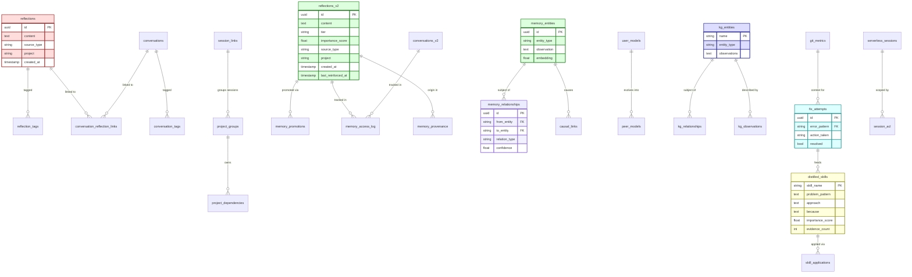
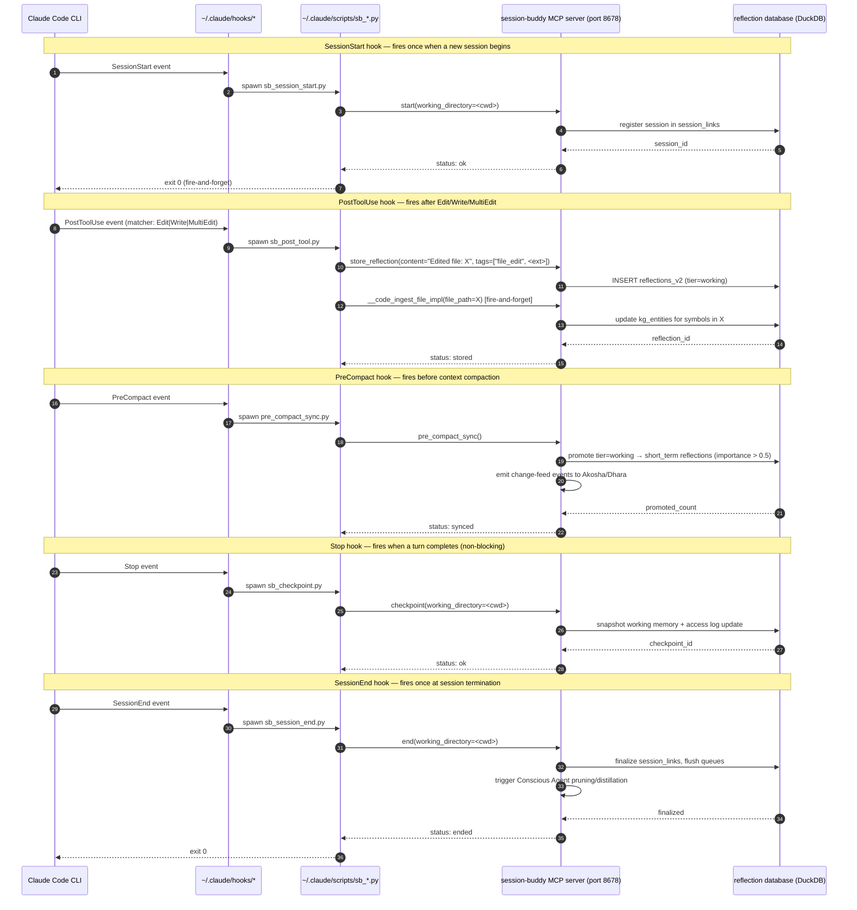

# Session-Buddy Memory Architecture

> **Status**: Living document. Updated whenever the storage schema, MCP surface, or integration contracts change.
> **Audience**: Bodai ecosystem contributors, Claude Code users, and downstream components (Akosha, Dhara, Mahavishnu, Crackerjack).
> **Source of truth**: The runtime schema in `session_buddy/adapters/reflection_adapter_oneiric.py` and the MCP tool implementations in `session_buddy/mcp/tools/`.

Session-Buddy is the **memory component** of the Bodai ecosystem. It owns
reflection storage, knowledge-graph state, distilled skills, serverless
session lifecycle, and the canonical MCP interface for every other
component to read or write memory.

This document describes what Session-Buddy stores, who reads and writes
it, and the integration contracts that the rest of the ecosystem depends
on. The three contract bugs captured below were the trigger for writing
it — they all stemmed from undocumented expectations about how the
schema and the MCP surface line up.

______________________________________________________________________

## Table of Contents

1. [Storage Inventory](#1-storage-inventory)
1. [MCP Write Surface](#2-mcp-write-surface)
1. [MCP Read Surface](#3-mcp-read-surface)
1. [Cross-Component Visibility](#4-cross-component-visibility)
1. [Integration Contract](#5-integration-contract)
1. [Sample Queries](#6-sample-queries)
1. [Diagrams](#7-diagrams)
1. [Operational Notes](#8-operational-notes)

______________________________________________________________________

## 1. Storage Inventory

Session-Buddy persists state in a single DuckDB file (with an optional
SQLite/PostgreSQL adapter via Oneiric). The schema is composed of five
logical layers, each introduced at a different phase of the project.
**All cross-layer joins go through `reflections_v2.id`** — that is the
single anchor point that downstream components MUST reference.

| Layer | Tables | Introduced | Owner / Purpose |
|-------|--------|------------|-----------------|
| **v1 legacy** | `reflections`, `reflections_fts`, `reflection_tags`, `conversations`, `conversation_tags`, `conversation_reflection_links`, `project_groups`, `project_dependencies`, `session_links`, `access_log_v2` | Phase 1 (pre-2026) | First-generation reflection store. Still queryable; writes deprecated. |
| **v2 tiered** | `reflections_v2`, `conversations_v2`, `memory_promotions`, `memory_access_log`, `memory_provenance`, `memory_entities`, `memory_relationships`, `user_models`, `peer_models`, `causal_links`, `distilled_skills`, `skill_applications` | Phase 2 (Q1 2026) | Tier-aware (working → short_term → long_term) memory with provenance, access tracking, and skill distillation. **All new writes go here.** |
| **Knowledge graph** | `kg_entities`, `kg_relationships`, `kg_observations` | Phase 3 (mid-2026) | Code-symbol graph derived from Mahavishnu indexing + on-edit hooks. Cross-system code recall. |
| **Crackerjack memory** | `fix_attempts`, `git_metrics`, `crackerjack_skill_names` | Phase 2.5 | Captures every Crackerjack self-improvement cycle so distilled skills trace back to actual fix evidence. |
| **Serverless sessions** | `serverless_sessions`, `session_acl` | Phase 4 | Externalized session state for ephemeral/serverless deployments (Redis/S3 backends). |

### Schema map

The diagram below shows the high-level entity relationships across
layers. Note the green nodes (v2 tiered) are the authoritative write
target; everything else is either legacy or specialized.



### Per-table ownership map

| Table | Read by | Written by | Retention |
|-------|---------|------------|-----------|
| `reflections` (v1) | legacy MCP tools | **DEPRECATED** — do not write | Migrate to `reflections_v2` then drop |
| `reflections_v2` | All read MCP tools, Akosha (semantic), Crackerjack (skill distillation) | `store_reflection`, hooks (`sb_post_tool.py`), Conscious Agent (promotion) | Long-term; tier-pruned by Conscious Agent |
| `conversations_v2` | search tools, Mahavishnu (workflow context) | `store_conversation_checkpoint`, `store_conversation` | Long-term |
| `memory_promotions` | Conscious Agent (audit), Akosha (timeline) | Conscious Agent | Indefinite (audit log) |
| `memory_access_log` | Conscious Agent (heat map), `tier_stats` | All read tools (every recall increments) | 90 days rolling |
| `memory_provenance` | Akosha (cross-source dedup), `lint_memory` | Every v2 write (auto-populated) | Indefinite |
| `memory_entities` / `memory_relationships` | Knowledge-graph tools, `_code_search_symbols_impl` | `_code_ingest_file_impl`, Conscious Agent | Refreshed on every code edit |
| `distilled_skills` | Crackerjack, `search_distilled_skills`, `distilled_skill_health` | Conscious Agent (`distill_skills_now`) | Reinforced on use; pruned if stale |
| `kg_entities` | Mahavishnu indexer reads back via `store_code_graph_from_mahavishnu` | `__code_ingest_file_impl` (PostToolUse hook) | Refreshed per file edit |
| `fix_attempts` | Crackerjack memory layer, `self_improvement_*` tools | Crackerjack self-improvement cycle | 365 days |
| `serverless_sessions` | `get_serverless_session`, `update_serverless_session` | `create_serverless_session`, lifecycle hooks | TTL-based (default 24h) |

______________________________________________________________________

## 2. MCP Write Surface

Tools that **create** records. The first three are the most-called entry
points; everything else is invoked by Conscious Agent, Crackerjack, or
external integrations.

| Tool | Layer | Caller (typical) | What it writes |
|------|-------|------------------|----------------|
| `store_reflection` | v2 | User, hooks, Mahavishnu workers | row in `reflections_v2` (tier=working) + `memory_provenance` |
| `store_conversation` / `store_conversation_checkpoint` | v2 | Mahavishnu, hooks, Crackerjack | row in `conversations_v2` |
| `__code_ingest_file_impl` | KG | `sb_post_tool.py` (PostToolUse) | rows in `kg_entities`, `kg_relationships`, `kg_observations` |
| `__code_ingest_directory_impl` | KG | Mahavishnu bulk indexer | bulk KG refresh |
| `batch_create_entities` | KG | Knowledge-graph migration scripts | multiple `memory_entities` |
| `create_relation` | KG | Knowledge-graph workers | row in `memory_relationships` |
| `add_observation` | KG | Knowledge-graph workers | appends to `memory_entities.observations` |
| `create_entity` | KG | Knowledge-graph workers | row in `memory_entities` |
| `store_code_graph_from_mahavishnu` | KG | Mahavishnu indexer | bulk KG persistence (called per indexing run) |
| `apply_pattern` | skills | User, workers | row in `skill_applications` |
| `capture_successful_pattern` | skills | Workers, Conscious Agent | updates `distilled_skills` |
| `rate_pattern_outcome` | skills | User feedback | updates `skill_applications.outcome` |
| `record_fix_success` | Crackerjack | Crackerjack self-improvement | row in `fix_attempts` |
| `distill_skills_now` | skills | Conscious Agent, manual | promotes patterns into `distilled_skills` |
| `update_peer_model` | v2 | Conscious Agent (Honcho-style) | row in `peer_models` |
| `create_session_context` / `restore_session_context` | serverless | serverless hook | rows in `serverless_sessions` |
| `create_serverless_session` | serverless | serverless entry | row in `serverless_sessions` |
| `update_serverless_session` | serverless | session lifecycle | row in `serverless_sessions` (update) |
| `pre_compact_sync` (side effect) | v2 | `pre_compact_sync.py` (PreCompact hook) | promotes tier=working → tier=short_term in `reflections_v2`; emits change-feed to Akosha |
| `checkpoint` (side effect) | v2 | `sb_checkpoint.py` (Stop hook) | snapshots working memory + updates `memory_access_log` |
| `end` (side effect) | v2 | `sb_session_end.py` (SessionEnd hook) | finalizes `session_links`, flushes queues, triggers Conscious Agent pruning/distillation |
| `start` (side effect) | v2 | `sb_session_start.py` (SessionStart hook) | registers session in `session_links`, primes caches |

### Hook-driven write flow

Five Claude Code hooks fire at every session boundary and call SB MCP
tools. The lifecycle is:



The hooks are wired in `~/.claude/settings.local.json` (not committed —
each user wires their own). The scripts live in `~/.claude/scripts/`.
If a hook fails (e.g., SB MCP is down), Claude Code logs the failure
and proceeds — capture is best-effort, not blocking.

______________________________________________________________________

## 3. MCP Read Surface

Tools that **query** records. The first cluster is the most-called
hot-path; the rest are specialized for Conscious Agent, Akosha, or
Mahavishnu workers.

### Hot-path semantic search

| Tool | Searches | Use when |
|------|----------|----------|
| `quick_search` | `reflections_v2` (semantic + keyword) | Default recall; returns top-N with score |
| `search_by_concept` | `reflections_v2` (concept expansion) | User says "how do we handle X" |
| `search_by_file` | `reflections_v2` filtered by file path | User references a specific file |
| `search_by_source` | `reflections_v2` filtered by source_type | Audit a particular source |
| `search_summary` | `reflections_v2` aggregated | Show word/theme distribution without raw matches |
| `progressive_search` | tiered across `reflections_v2`, `memory_entities`, `distilled_skills` | Multi-tier recall with early stopping |
| `search_conversations` | `conversations_v2` | Find past conversation fragments |
| `search_temporal` | `reflections_v2` filtered by time expression | "yesterday", "last week", etc. |

### Knowledge graph

| Tool | Searches | Use when |
|------|----------|----------|
| `__code_search_symbols_impl` | `kg_entities`, `memory_entities` | Find a function/class by name |
| `__code_get_symbol_graph_impl` | `kg_relationships` | Caller/callee chain for a symbol |
| `__code_impact_analysis_impl` | `kg_relationships` | What depends on this symbol |
| `code_call_chain` | `kg_relationships` (transitive) | Multi-hop call graph |
| `search_entities` | `memory_entities` | Find entities by name/observation |
| `find_path` | `memory_relationships` (DuckPGQ) | Shortest path between two entities |
| `causal_chain` | `causal_links` | Causal trace from a starting point |
| `find_duplicates` | `reflections_v2` (MinHash) | Detect near-duplicate content |

### Skills and patterns

| Tool | Searches | Use when |
|------|----------|----------|
| `search_distilled_skills` | `distilled_skills` | Find a learned skill by problem description |
| `invoke_skill` | `distilled_skills` | Get workflow guidance from a skill |
| `distilled_skill_health` | `distilled_skills` | Report stale/under-utilized skills |
| `search_similar_patterns` | `skill_applications` | Find past pattern applications |
| `get_skill_details` | `distilled_skills` | Skill metadata |
| `get_skill_dependencies` | `skill_applications` | Skills commonly used together |
| `get_skill_trend` | `distilled_skills` | Skill effectiveness trend |
| `list_skills` | `distilled_skills` | All available skills |

### Tier, stats, and operational

| Tool | Searches | Use when |
|------|----------|----------|
| `tier_stats` | `reflections_v2`, `memory_promotions` | Tier configuration + usage |
| `get_metrics_summary` | `memory_access_log`, `session_links` | Session metric dashboard |
| `get_knowledge_graph_stats` | `kg_*` | KG size/health |
| `get_relationship_confidence_stats` | `memory_relationships` | Confidence distribution |
| `query_cache_stats` | in-process L1/L2 caches | Cache hit rate |
| `deduplication_stats` | `reflections_v2` (MinHash) | Storage efficiency |
| `get_cleanup_recommendations` | cross-table | Pruning suggestions |
| `analyze_graph_connectivity` | `kg_*` | Graph health |
| `get_real_time_metrics` | `memory_access_log` | Last-hour skill usage |
| `get_intelligence_stats` | cross-table | Conscious Agent metrics |
| `get_error_hotspots` | `fix_attempts` | Error pattern density |
| `query_similar_errors` | `fix_attempts` | Find past errors + fixes |
| `reflection_stats` | `reflections_v2` | Database health |
| `get_reflection_health` | `reflections_v2` | Staleness report |

### Serverless sessions

| Tool | Searches | Use when |
|------|----------|----------|
| `get_serverless_session` | `serverless_sessions` | Restore by session_id |
| `list_serverless_sessions` | `serverless_sessions` | List active or expired |
| `test_serverless_storage` | external backend (Redis/S3) | Backend health check |
| `configure_serverless_storage` | external backend config | Switch storage backend |

______________________________________________________________________

## 4. Cross-Component Visibility

What other components see in Session-Buddy's memory. Session-Buddy is
the **only** place in the ecosystem where all of this data exists; the
other components either read from it, write to it, or replicate
selected views.

| Consumer | Surface | What it reads | What it writes |
|----------|---------|---------------|----------------|
| **Akosha** | Semantic search MCP (`search_all_systems`, `find_function_usage`, `search_code_patterns`, `get_code_problems`) | `reflections_v2`, `kg_entities`, `distilled_skills` | (read-only) — sends feedback via `akosha.fitness_analyzer` to Conscious Agent |
| **Dhara** | State replication (`akosha_sync_status`, `sync_to_akosha`) | `reflections_v2`, `conversations_v2`, `distilled_skills` | (read-only locally; curates versioned snapshots in Dhara) |
| **Mahavishnu** | Worker pool tools (`pool_route_execute`, `store_code_graph_from_mahavishnu`, `__code_ingest_*`) | `reflections_v2` (for workflow context), `kg_*` (for code recall) | `kg_entities` via `store_code_graph_from_mahavishnu`; `reflections_v2` via `store_reflection` from worker output |
| **Crackerjack** | Memory layer MCP (`crackerjack_run`, `crackerjack_help`, `crackerjack_metrics`, `crackerjack_history`, `self_improvement_*`, `record_fix_success`) | `distilled_skills`, `fix_attempts`, `distilled_skill_health` | `fix_attempts` via `record_fix_success`; `distilled_skills` via Conscious Agent distillation |
| **Oneiric** | Settings + adapter discovery | (config only — does not query data) | (config only) — provides `ReflectionAdapterSettings` |
| **Claude Code** | Hooks (5 wired) + MCP | All read tools, all write tools | All write tools (via hooks) |

### What Session-Buddy does NOT store

To avoid double-bookkeeping with neighbors, Session-Buddy intentionally
**does not** store:

- **OpenTelemetry trace spans** — those live in Akosha (`mcp__akosha__query_local_traces`) and Mahavishnu's OTel ingester.
- **Pool/worker runtime state** — that lives in Dhara (`mahavishnu/workflow-results/{id}/`) and the pool manager's in-memory state.
- **Crackerjack fix attempts and skill effectiveness** — those live in Crackerjack's own DB; only the cross-system distilled skill view is replicated into SB.
- **Code graph topology** — Mahavishnu owns the indexer; SB stores the persisted snapshot for recall only.
- **Active alerts** — those live in Mahavishnu's alerting subsystem.
- **LLM provider configuration / API keys** — those live in Oneiric + env vars.

______________________________________________________________________

## 5. Integration Contract

The contract between Session-Buddy and its consumers is implicit in the
schema and the MCP surface, but three specific contracts caused real
bugs and should be made explicit:

### Contract 5.1 — Reflection storage goes to `reflections_v2`, not `conversations_v2`

**Bug**: The `_quick_search_impl` MCP wrapper previously called
`db.search_conversations` (querying `conversations_v2`) while
`store_reflection` wrote to `reflections_v2`. The two tables are
**different schemas** with different tier semantics and different
embedding columns. Storing a reflection and then quick-searching for it
always returned "No results found".

**Contract**: Every MCP tool that writes a *reflection* MUST go through
`store_reflection`, which writes to `reflections_v2`. Every MCP tool that
reads reflections MUST query `reflections_v2`. The `conversations_v2`
table is for raw conversation fragments and is queried only by
`search_conversations` / `search_by_file` (conversation scope).

**Regression test**:
`tests/integration/test_reflection_round_trip.py::test_store_then_quick_search_round_trip`
asserts identity (stored content echoed in search output), not just
`len(results) >= 1` — the loose check would have passed against any
unrelated record.

### Contract 5.2 — DI registration key must be the class, not a string

**Bug**: `progressive_search.py:484` (pre-fix) used a bare-string DI key
(e.g. `"reflection_db"`) that never matched any registration. The unit
tests didn't catch this because they bypassed DI registration entirely
via fixtures.

**Contract**: All MCP wrappers resolve the reflection database via
`require_reflection_database()`, which reads from the Oneiric DI
container under the **class key** `ReflectionDatabaseAdapterOneiric`.
Any code that calls `depends.get("reflection_db")` or similar with a
bare-string key is broken by design.

**Regression test**:
`tests/integration/test_init_reflection_adapter.py::test_init_reflection_adapter_registers_under_class_key`
runs the canonical registration path (`adapters/lifecycle.init_reflection_adapter()`)
then resolves via `require_reflection_database()` — exactly what every
MCP wrapper does in production.

### Contract 5.3 — `store_reflection` must thread the `project` parameter through

**Bug**: The `project` argument was silently dropped on the
`_store_reflection_impl` path (the value reached the adapter as `None`
for several v2 releases). Project-scoped recall then saw every
reflection as belonging to no project, and `search_reflections(..., project="mahavishnu")` returned everything instead of nothing.

**Contract**: `store_reflection(content, tags=..., project=...)` MUST
persist `project` on the `reflections_v2` row. The `search_reflections`,
`quick_search`, and `search_by_concept` wrappers MUST honor the
`project` filter when provided.

**Regression test**:
`tests/integration/test_reflection_round_trip.py::test_store_with_project_filters_by_project`
stores reflections under two different projects and asserts that
project-scoped search returns only the matching one.

### General contract test policy

- **No fixture-only registration**: any test that exercises the DI
  container must call the canonical `adapters/lifecycle.init_reflection_adapter()`
  path, not a fixture that bypasses registration.
- **No mocks on the DB layer**: tests that verify a write/read contract
  must use a real Oneiric adapter in `tmp_path`, not a `MagicMock`. The
  round-trip identity check (stored ID appears in search output) is the
  minimum invariant.
- **No `len() >= 1` assertions for search tests**: every search-result
  assertion must verify record identity (matching ID or unique-content
  marker), not just non-emptiness.

These three contracts are the minimum bar; new MCP wrappers should add
similar tests when introducing new write/read pairs.

______________________________________________________________________

## 6. Sample Queries

Realistic MCP invocations against Session-Buddy from a Claude Code
session. These are the queries a developer would actually run during
work — not contrived examples.

### Q1 — Recall a past decision

**Goal**: Find a previous reflection about a decision involving memory
routing.

```python
mcp__session-buddy__search_by_concept(
    concept="memory routing rules for project memories",
    limit=5,
    min_score=0.6,
)
```

Returns up to 5 reflections whose semantic embedding matches "memory
routing" with cosine similarity ≥ 0.6. Expected output shape:

```
[reflection_id] [score] [tags] [content snippet] [created_at]
```

### Q2 — Find code related to a symbol

**Goal**: Discover what other code depends on `PoolManager.route_task`.

```python
mcp__session-buddy__code_call_chain(
    symbol_name="PoolManager.route_task",
    direction="callers",
    max_depth=3,
)
```

Returns the transitive caller chain up to 3 hops, ordered by depth.

### Q3 — Recall by file path

**Goal**: Find reflections referencing `mahavishnu/pools/manager.py`.

```python
mcp__session-buddy__search_by_file(
    file_path="mahavishnu/pools/manager.py",
    limit=10,
)
```

Filters `reflections_v2` where the row's associated file metadata matches
the path.

### Q4 — Check skill health before reuse

**Goal**: Before invoking `crackerjack-orchestrator`, see how
healthy it is.

```python
mcp__session-buddy__distilled_skill_health(
    skill_names=["crackerjack-orchestrator", "crackerjack-format"],
    threshold_days=60,
)
```

Reports `stale`, `under_utilized`, `cold`, or `fresh` per skill.
Under-utilized skills with `importance_score >= 0.9` are likely
over-confidence without evidence.

### Q5 — Project-scoped recall

**Goal**: Find reflections stored under the `mahavishnu` project.

```python
mcp__session-buddy__quick_search(
    query="DI registration key",
    project="mahavishnu",
    min_score=0.5,
)
```

Filters at the adapter level so the recall set is project-pure.

### Q6 — Tier distribution snapshot

**Goal**: Check how much is in working vs short_term vs long_term.

```python
mcp__session-buddy__tier_stats()
```

Returns the current tier configuration and per-tier counts. Useful
before running `pre_compact_sync` or after a major session.

### Q7 — Find a skill by problem description

**Goal**: Search distilled skills for "how to fix ty ratchet count
mismatch with crackerjack run".

```python
mcp__session-buddy__search_distilled_skills(
    query="ty ratchet count vs crackerjack run count",
    limit=5,
)
```

Case-insensitive substring match across `problem_pattern`, `approach`,
and `because`. The `[[ty-ratchet-count-vs-crackerjack-count]]` memory
lives here.

### Q8 — End-to-end round-trip audit

**Goal**: Verify `store_reflection` → `quick_search` returns what you
stored (the regression test exposed manually).

```python
# Store
mcp__session-buddy__store_reflection(
    content="unique-marker-abc123 round trip test",
    tags=["audit", "round-trip"],
    project="session-buddy",
)

# Recall
mcp__session-buddy__quick_search(
    query="unique-marker-abc123",
    min_score=0.1,
)
```

Expected: search output contains the literal string
`unique-marker-abc123`. If it returns "No results", Bug 5.1 (table
mismatch) has regressed.

### Q9 — Cross-session knowledge graph query

**Goal**: Find the shortest path between two entities in the
knowledge graph.

```python
mcp__session-buddy__find_path(
    from_entity="user:les",
    to_entity="system:mahavishnu",
    max_depth=4,
)
```

Walks `memory_relationships` using DuckPGQ SQL/PGQ. Returns
`"user:les → worked_on → project:mahavishnu"` or empty if no path
exists within depth.

### Q10 — Serverless session restore

**Goal**: Resume a session after a worker restart.

```python
mcp__session-buddy__get_serverless_session(session_id="abc-123-...")
```

Returns the session payload from Redis/S3/local backend per
`configure_serverless_storage`. ACL-checked via `session_acl`.

______________________________________________________________________

## 7. Diagrams

Three diagrams are persisted with this document. Two are embedded above:

1. **Schema map** (Section 1) — `erDiagram` of all 5 storage layers and their relationships.
1. **Hook timeline** (Section 2) — `sequenceDiagram` of the 5 Claude Code hooks firing SB MCP tools.

The third diagram — **Cross-system data flow** — lives in the global
Bodai docs at `bodai/docs/memory/INDEX.md` because it spans all six
components, not just Session-Buddy.

The **Memory routing decision tree** (global) and **Cross-system data
flow** (global) will be authored in Stage 3 of the documentation plan.
Per-repo diagrams (schema map, hook timeline, per-table ownership) live
in each component's `docs/architecture/MEMORY_ARCHITECTURE.md`.

______________________________________________________________________

## 8. Operational Notes

### Backup and migration

- The DuckDB file is the single source of truth. Daily snapshot script lives in `scripts/backup_reflection_db.py`.
- Schema migrations are run via `crackerjack run` (which includes `session-buddy migrate`); see `mahavishnu/migrations/` for cross-component migrations.
- The `reflections` (v1) table is read-compatible but should not be written to; new writes always go to `reflections_v2`.

### Conscious Agent lifecycle

The Conscious Agent runs as a background task and:

1. **Promotes** tier=working → short_term during `pre_compact_sync` (importance_score > 0.5).
1. **Distills** high-evidence patterns into `distilled_skills` (calls `distill_skills_now`).
1. **Prunes** stale reflections (older than 90 days, never accessed).
1. **Updates** peer models via `update_peer_model` (Honcho-style theory of mind).
1. **Emits** change-feed events to Akosha and Dhara for replication.

### Performance characteristics

| Operation | Typical latency | Hot path? |
|-----------|-----------------|-----------|
| `quick_search` | 50-200 ms | Yes |
| `search_by_concept` | 80-300 ms | Yes |
| `store_reflection` | 20-80 ms | Yes (hook-driven) |
| `__code_ingest_file_impl` | 200-800 ms (per file) | PostToolUse hook |
| `progressive_search` | 100-500 ms (4 tiers) | Yes |
| `distill_skills_now` | 5-30 s | Background |
| `pre_compact_sync` | 1-5 s | PreCompact hook |
| `end` (full session finalize) | 2-10 s | SessionEnd hook |

### Failure modes

- **MCP server down**: hooks log failure and Claude Code proceeds. Memory capture is best-effort.
- **DuckDB locked**: most operations retry with exponential backoff. Long locks surface as `RuntimeError: database is locked`.
- **Embedding generation fails**: `store_reflection` falls back to keyword-only indexing; `quick_search` degrades to lexical match with the same content marker.
- **Conscious Agent crashes**: re-launched by the lifecycle supervisor; tier state in DB is recoverable.

______________________________________________________________________

## See Also

- `bodai/docs/memory/INDEX.md` (Stage 3) — Global memory routing decision tree and cross-system data flow.
- `session_buddy/adapters/reflection_adapter_oneiric.py` — Authoritative schema definition.
- `session_buddy/mcp/tools/memory/memory_tools.py` — MCP read surface implementations.
- `session_buddy/mcp/tools/memory/memory_write_tools.py` — MCP write surface implementations.
- `tests/integration/test_reflection_round_trip.py` — Contract regression tests for Section 5.
- `~/.claude/hooks/` — Hook script wiring (per-user, not committed).
- `~/.claude/settings.local.json` — Hook matchers and command paths (per-user).
