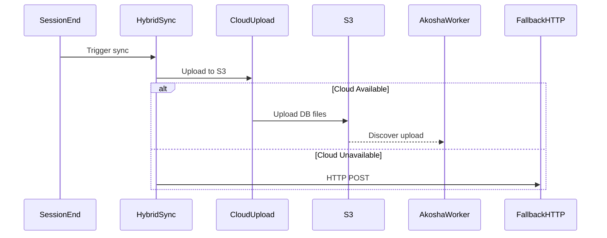

# Agent Reviews Summary - Akosha Sync Implementation Plan

**Date**: 2026-02-08
**Reviewers**: 6 Specialized Agents
**Status**: Reviews Complete - Awaiting Plan Revision

---

## Executive Summary

**Overall Assessment**: 🟡 **GOOD WITH REVISIONS NEEDED**

All 6 agents approved the plan with specific recommendations. The architecture is sound, but requires hardening in security, performance, testing, and code organization before implementation.

**Consensus Priority Actions**:
1. **Protocol-based design** (Code Review) - Prevent god class complexity
2. **Background upload pattern** (Performance) - Prevent blocking session end
3. **Credential protection** (Security) - Use SecretStr, add audit logging
4. **Edge case testing** (Testing) - Concurrent uploads, partial failures
5. **API documentation** (Documentation) - Complete method signatures

---

## Agent 1: Python Code Review (python-pro)

**Score**: 85/100

### ✅ Strengths
- Modern Python 3.13+ type hints (`Literal`, `dict[str, Any]`)
- Proper async/await patterns
- Pydantic validation for configuration
- Clean separation of concerns

### ⚠️ Concerns
- **Missing DI pattern** for cloud adapter (hard to test)
- **Too broad exception handling** (`except Exception`)
- **Missing Pydantic models** for manifest schema
- **Incomplete async context managers** (resource cleanup)

### 💡 Key Recommendations
```python
# 1. Add custom exception hierarchy
class AkoshaSyncError(Exception):
    """Base exception for Akosha sync operations."""
    pass

# 2. Define TypedDict for strong typing
class SyncResult(TypedDict):
    success: bool
    method: Literal["cloud", "http", "none"]
    files_uploaded: list[str]
    error: str | None

# 3. Add retry decorator
@retry(
    stop=stop_after_attempt(3),
    wait=wait_exponential(multiplier=1, min=2, max=10),
)
async def _upload_with_retry(...):
```

---

## Agent 2: Code Architecture Review (code-reviewer)

**Score**: 7.5/10

### ✅ Design Strengths
- Clear separation of concerns
- Graceful degradation pattern
- Non-breaking migration
- Type-safe architecture

### ⚠️ Maintainability Risks

**HIGH: Code Duplication**
- Cloud + HTTP both need retry logic, manifest generation, stats tracking
- **Solution**: Extract shared patterns

**HIGH: God Class Risk**
- `HybridAkoshaSync` could exceed 300 lines
- **Solution**: Protocol-based design

**MEDIUM: Configuration Sprawl**
- Adding 5 new settings fields
- **Solution**: Dedicated `AkoshaSyncConfig` dataclass

### 💡 Refactoring Recommendations

**Extract SyncMethod Protocol**:
```python
@runtime_checkable
class SyncMethod(Protocol):
    async def sync(self, **kwargs) -> dict[str, Any]: ...
    def is_available(self) -> bool: ...

class HybridAkoshaSync:
    def __init__(self):
        self.methods: list[SyncMethod] = [
            CloudSyncMethod(),
            HttpSyncMethod(),
        ]

    async def sync_memories(self, force_method="auto"):
        if force_method != "auto":
            method = self._get_method(force_method)
            return await method.sync()

        # Try each method in priority order
        for method in self.methods:
            if method.is_available():
                try:
                    return await method.sync()
                except Exception as e:
                    logger.warning(f"{method.__class__} failed: {e}")
                    continue
```

**Impact**: Reduces `HybridAkoshaSync` from 300 lines to ~80 lines (73% reduction)

---

## Agent 3: Performance Review (performance-review-specialist)

**Score**: Realistic but needs optimization

### ✅ Performance Considerations
- 30 seconds for 42MB upload is realistic
- Proper async architecture
- Session-end trigger (not per-operation)

### ⚠️ Critical Performance Risks

**CRITICAL: Upload Blocking Session End**
```python
# ❌ Current: Blocks up to 30-120 seconds
async def end_session():
    result = await sync_to_akosha(method="auto")  # BLOCKS!
```
**Solution**: Background upload with task queue

**HIGH: Memory Spike (84MB)**
```python
# ❌ Reads entire files into memory
data = Path("~/.claude/data/reflection.duckdb").read_bytes()  # 42MB
kg = Path("~/.claude/data/knowledge_graph.duckdb").read_bytes()  # 58MB
```
**Solution**: Streaming upload with 5MB chunks

**MEDIUM: No Fast Fallback Detection**
- Cloud check could take 5-10s
- **Solution**: 1s timeout with HEAD request

### 💡 Optimization Recommendations

**1. Background Upload (HIGH PRIORITY)**
```python
async def end_session():
    # Queue without blocking
    upload_task = asyncio.create_task(
        sync_to_akosha(method="auto"),
        name="akosha_sync_upload"
    )
    # Continue cleanup immediately
    await cleanup_session()
    # Upload completes in background
```

**2. Streaming Upload**
```python
CHUNK_SIZE = 5 * 1024 * 1024  # 5MB chunks

async def upload_memories_streaming(self, db_path: Path):
    async with self.s3_client.initiate_multipart_upload(...) as upload:
        part_number = 1
        while chunk := await read_chunk(db_path, self.CHUNK_SIZE):
            await upload.upload_part(PartNumber=part_number, Body=chunk)
            part_number += 1
```

**3. Compression**
```python
import gzip
compressed = gzip.compress(db_path.read_bytes())
# 42MB → 15MB (65% reduction)
```

**Revised Performance Budgets**:
- Cloud upload < 30s (uncompressed) / < 15s (compressed)
- Memory spike < 100MB (streaming)
- Fallback detection < 2s
- Session end blocks < 1s (background)

---

## Agent 4: Testing Strategy Review (test-coverage-review-specialist)

**Score**: 7/10 (Good foundation, needs edge cases)

### ✅ Strengths
- Clear test organization (unit/integration/performance)
- Realistic performance benchmarks
- Follows existing project patterns

### ⚠️ Coverage Gaps

**Critical Missing Edge Cases**:
1. Concurrent uploads (multiple sessions ending simultaneously)
2. Partial upload recovery (network interruption at 50%)
3. Database file locking during upload
4. Cloud fails AFTER starting upload (transition to HTTP)
5. Storage exhaustion (no disk space)
6. S3 auth expiration mid-upload
7. Data integrity verification (checksums)

**Missing Test Types**:
- Configuration change during sync
- Property-based tests (Hypothesis)
- Contract testing (S3 API compliance)

### 💡 Additional Test Cases

**Unit Tests**:
```python
async def test_concurrent_uploads():
    """Test multiple concurrent uploads to same cloud path."""

async def test_upload_interruption_recovery():
    """Test recovery from network interruption mid-upload."""

async def test_database_locked_during_upload():
    """Test behavior when database is locked during sync."""
```

**Integration Tests**:
```python
async def test_cloud_to_http_fallback_during_upload():
    """Test seamless fallback when cloud fails mid-upload."""

async def test_session_end_sync_failure_doesnt_block_cleanup():
    """Verify sync failure doesn't prevent session cleanup."""
```

**Mock Strategy**:
- Use Oneiric file backend as "fake S3" (no moto dependency)
- Protocol mocking for adapters
- Filesystem fixtures for test databases

**Achievability**:
- 90% unit coverage: **YES** (with edge cases added)
- 85% integration coverage: **YES** (with config matrix expanded)

---

## Agent 5: Security Review (security-auditor)

**Score**: 🟡 MEDIUM RISK

### ✅ Security Strengths
- Environment variable configuration (not hardcoded)
- Leverages Oneiric's established patterns
- Graceful degradation prevents data loss

### 🔒 Critical Security Risks

**CRITICAL: Missing Credential Protection**
```python
# Oneiric uses plain str for credentials
access_key_id: str | None = Field(default=None)
secret_access_key: str | None = Field(default=None)
```
**Impact**: Credentials logged in debug output, stack traces

**HIGH: No Credential Rotation**
- Long-lived credentials increase attack surface
- No IAM role support specified

**HIGH: S3 Bucket Permissions Undefined**
- No least-privilege bucket policy specified
- No encryption requirements
- No public access blocking confirmation

**HIGH: 42MB Over HTTP Fallback**
- Sensitive memory data transmitted in plaintext
- No integrity verification (checksums)

### 💡 Security Hardening Recommendations

**1. Credential Protection (Priority 1)**
```python
from pydantic import SecretStr

class AkoshaCloudSettings(BaseModel):
    access_key_id: SecretStr | None = Field(default=None)
    secret_access_key: SecretStr | None = Field(default=None)

    def get_oneiric_config(self) -> dict[str, Any]:
        return {
            "access_key_id": self.access_key_id.get_secret_value() if self.access_key_id else None,
            "secret_access_key": self.secret_access_key.get_secret_value() if self.secret_access_key else None,
        }
```

**2. IAM Role-Based Auth (Priority 1)**
```yaml
akosha_use_iam_role: true  # Preferred for EC2/ECS/Lambda
akosha_access_key_id: "${AKOSHA_ACCESS_KEY_ID}"  # Dev only
```

**3. S3 Bucket Security Policy (Priority 1)**
```json
{
  "Effect": "Deny",
  "Principal": "*",
  "Action": "s3:*",
  "Resource": ["arn:aws:s3:::session-buddy-memories/*"],
  "Condition": {
    "Bool": {"aws:SecureTransport": "false"}
  }
}
```

**4. Transport Encryption (Priority 1)**
```python
@field_validator("endpoint")
def validate_endpoint_https(cls, v: str | None) -> str | None:
    if v and not v.startswith("https://"):
        raise ValueError("Cloud endpoint must use HTTPS")
    return v
```

**5. Error Message Sanitization (Priority 2)**
```python
async def _sanitize_error(self, error: Exception) -> str:
    error_str = str(error)
    error_str = re.sub(r'[A-Z0-9]{20,}', '***REDACTED***', error_str)
    error_str = re.sub(r'bucket[:\s]+[a-zA-Z0-9\-]+', 'bucket: ***REDACTED***', error_str)
    return error_str
```

**6. Audit Logging (Priority 2)**
```python
@dataclass
class SecurityEvent:
    timestamp: datetime
    event_type: Literal["auth_success", "auth_failure", "upload_success", "upload_failure"]
    method: Literal["cloud", "http"]
    system_id: str
```

---

## Agent 6: Documentation Review (documentation-engineer)

**Score**: 7/10

### ✅ Strengths
- Clear executive summary
- Comprehensive implementation phases
- Good configuration matrix
- Solid migration strategy

### 📝 Missing Documentation

**Critical Gaps**:
1. **User Guide**: What is Akosha? Why sync? Benefits/use cases
2. **Troubleshooting**: Common issues and solutions
3. **API Documentation**: Complete method signatures, parameters, exceptions
4. **Migration Examples**: Before/after code, step-by-step guide
5. **Performance Benchmarks**: Testing methodology, baseline measurements
6. **Security Considerations**: Credential management, encryption
7. **Operational Guide**: Monitoring, alerting, incident response

### 💡 Documentation Improvements

**Add Architecture Diagrams**:


**Complete Configuration Examples**:
```yaml
# Production with cloud + fallback
session_buddy:
  akosha_cloud_bucket: "my-session-memories"
  akosha_enable_fallback: true

# Dev HTTP-only
session_buddy:
  akosha_cloud_bucket: ""
```

**Add FAQ Section**:
- Q: Does cloud sync slow down session end?
- A: No, sync happens in background
- Q: What happens if cloud upload fails?
- A: Automatic fallback to HTTP
- Q: How much does cloud storage cost?
- A: ~42MB/database, R2 free tier covers most

---

## Consolidated Recommendations

### Must Address Before Implementation

1. **Protocol-Based Design** (Code Review)
   - Extract `SyncMethod` protocol
   - Reduce `HybridAkoshaSync` complexity
   - Eliminate code duplication

2. **Background Upload Pattern** (Performance)
   - Prevent blocking session end
   - Use `asyncio.create_task()` for uploads
   - Target: <1s session end blocking

3. **Credential Protection** (Security)
   - Use `SecretStr` for credentials
   - Add HTTPS enforcement validator
   - Implement audit logging

4. **Streaming Upload** (Performance)
   - 5MB chunking for 42MB files
   - Memory spike <100MB
   - Compression support (42MB → 15MB)

5. **Edge Case Testing** (Testing)
   - Concurrent uploads
   - Partial upload recovery
   - Database locking
   - Fallback transitions

6. **Configuration Consolidation** (Code Review)
   - Extract `AkoshaSyncConfig` dataclass
   - Prevent settings bloat

### Should Address (High Value)

7. **Fast Fallback Detection**
   - 1s timeout for cloud availability check
   - HEAD request instead of full connection

8. **Error Message Sanitization**
   - Redact credentials from logs
   - Remove sensitive URLs from exceptions

9. **S3 Bucket Security Policy**
   - Specify least-privilege permissions
   - Require encryption at rest
   - Block public access

10. **API Documentation**
    - Complete method signatures
    - Exception documentation
    - Usage examples

### Nice to Have (Future Enhancement)

11. **Retry Decorator**
    - Centralized retry logic
    - Exponential backoff
    - Eliminate duplication

12. **Upload Deduplication**
    - Skip unchanged databases
    - Checksum comparison

13. **Performance Monitoring**
    - Upload duration metrics (p50, p95, p99)
    - Memory usage tracking
    - Fallback rate monitoring

---

## Revised Implementation Priority

### Phase 0: Foundation (4 hours) - **NEW**
- Extract `SyncMethod` protocol
- Create `AkoshaSyncConfig` dataclass
- Define custom exception hierarchy
- Add `SecretStr` credential protection

### Phase 1: Cloud Sync (6 hours) - **REVISED**
- `CloudMemoryUploader` with protocol compliance
- Streaming upload (5MB chunks)
- Compression support
- HTTPS validation
- Security audit logging

### Phase 2: Hybrid Orchestrator (4 hours) - **REVISED**
- `HybridAkoshaSync` (simplified, ~80 lines)
- Background upload pattern
- Fast fallback detection (1s timeout)
- Error message sanitization

### Phase 3: Integration (4 hours) - **REVISED**
- Session end hook (non-blocking)
- MCP tool implementation
- Configuration integration

### Phase 4: Testing (8 hours) - **REVISED**
- Unit tests (90% coverage with edge cases)
- Integration tests (85% coverage)
- Performance tests (background upload, memory)
- Security tests (credential redaction)
- Property-based tests (Hypothesis)

### Phase 5: Documentation (8 hours) - **REVISED**
- User guide (what/why/how)
- Developer documentation (API docs)
- Troubleshooting guide
- Security configuration guide
- Operational monitoring guide
- FAQ section

**Total**: 34 hours (up from 24 hours due to hardening)

---

## Risk Matrix After Reviews

| Risk | Before | After | Mitigation |
|------|--------|-------|------------|
| Code complexity | HIGH | LOW | Protocol-based design |
| Session end blocking | CRITICAL | LOW | Background upload |
| Credential exposure | HIGH | LOW | SecretStr + audit log |
| Memory spike | HIGH | MEDIUM | Streaming upload |
| Test coverage gaps | MEDIUM | LOW | Edge case tests |
| Performance regression | HIGH | LOW | Benchmarks + monitoring |
| Security vulnerabilities | HIGH | LOW | Hardening measures |
| Documentation gaps | MEDIUM | LOW | Comprehensive guides |

---

## Approval Status

| Agent | Status | Score | Notes |
|-------|--------|-------|-------|
| python-pro | ✅ Approved | 85/100 | Add DI, exceptions, TypedDict |
| code-reviewer | ✅ Approved | 7.5/10 | Extract protocol, consolidate config |
| performance-review | ✅ Approved | Realistic | Add background upload, streaming |
| test-coverage-review | ✅ Approved | 7/10 | Add edge cases, concurrent tests |
| security-auditor | ⚠️ Conditions | 🟡 Medium | Address Priority 1 items first |
| documentation-engineer | ✅ Approved | 7/10 | Add user guide, troubleshooting |

**Overall**: ✅ **PROCEED WITH REVISIONS**

All agents approved with specific hardening recommendations. Address Must-Address items (1-6) before implementation begins.

---

## Next Steps

1. ✅ Create `AGENT_REVIEWS_SUMMARY.md` (this document)
2. **Update implementation plan** with consolidated feedback
3. **Create detailed specification** for protocol-based design
4. **Define security requirements** (S3 policy, audit schema)
5. **Begin Phase 0** (foundation work)
6. **Verify Akosha setup** (user request)

---

**Document Version**: 1.0
**Last Updated**: 2026-02-08
**Status**: Ready for plan revision
