# Session-Buddy Operational Modes - Architecture Diagram

## Mode Selection Flow

## Mode Comparison Matrix

```mermaid
graph LR
    subgraph Lite Mode
        L1[⚡ Fast Startup]
        L2[💾 No Persistence]
        L3[📦 Minimal Features]
        L4[🧪 Testing/CI/CD]
    end

    subgraph Standard Mode
        S1[💾 Persistent Storage]
        S2[🧠 Full Features]
        S3[🌐 Multi-Project]
        S4[🚀 Production Ready]
    end

    Lite[Lite Mode] --> L1
    Lite --> L2
    Lite --> L3
    Lite --> L4

    Standard[Standard Mode] --> S1
    Standard --> S2
    Standard --> S3
    Standard --> S4

    style Lite fill:#fff9c4
    style Standard fill:#b2dfdb
```

## Architecture Components

## Data Flow

## Feature Flags

## Startup Sequence Comparison

## Configuration Layering

## Deployment Scenarios

## Performance Metrics

